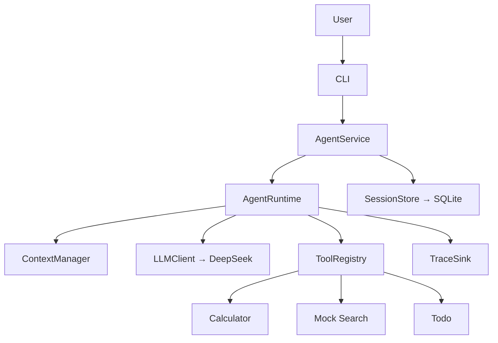

# Minimal Agent Runtime

> 中文文档导航：[docs/README.zh-CN.md](docs/README.zh-CN.md)

## 项目概述

Minimal Agent Runtime 是一个从零实现、不依赖 Agent Framework 的最小 Python
Agent Runtime，完整展示以下核心循环：

```text
用户 → LLM → 工具调用 → 工具结果 → LLM → 最终回答
```

项目没有使用 LangGraph、OpenHands 或其他 Agent Framework。Runtime 通过
OpenAI-compatible Chat Completions API 调用 DeepSeek V4 Flash，并保持实现足够小，
使关键设计和控制流可以逐行解释。

## 已实现能力

- 有最大决策次数限制的 LLM/Tool 循环
- 基于 JSON Schema 的 Tool Registry，不使用关键词硬编码路由
- Calculator、确定性 Mock Search、Session 级 Todo
- 单轮多个 Tool Call，按 Provider 返回顺序执行
- Tool 失败转换为结构化结果并返回 LLM
- SQLite Session 持久化，使用 `(user_id, session_id)` 复合身份隔离
- 完整请求预算、滚动 Summary 和最近完整轮次选择
- 持久化 Checkpoint 与中断 Turn 恢复
- 结构化脱敏 Trace 和 Provider-neutral Domain Error
- DeepSeek 真实 API Adapter，关闭 Thinking 和 SDK 隐式 Retry
- 可交互 CLI、确定性离线测试和显式启用的真实 Provider 测试

## 系统架构


`AgentRuntime` 负责有界决策循环；`AgentService` 只负责加载 Session 和持久化
Checkpoint；CLI 只处理终端输入输出。详细内容参见
[架构文档](docs/architecture.md)和[系统流程图](docs/diagrams.md)。

## Agent Loop

核心循环可以简化为：

```python
for step in range(max_steps):
    response = await llm.complete(messages, tools)
    if response.is_final:
        return response
    for tool_call in response.tool_calls:
        result = await tools.execute(tool_call)
        messages.append(result)
```

实际实现还包含持久化 Checkpoint、Context 管理、Trace、Tool 错误标准化和中断
Turn 恢复。同一 LLM Response 中的多个工具按返回顺序执行，并共享一个
`loop_step`。

## 项目结构

```text
src/minimal_agent/
├── app.py              # 生产组件组装
├── cli.py              # 交互式终端 Adapter
├── runtime.py          # 有界 Agent/Tool 循环
├── service.py          # 持久化 Session Facade
├── context.py          # Context 预算和压缩
├── models.py           # Provider-neutral 边界模型
├── llm/                # DeepSeek Chat Completions Adapter
├── tools/              # Registry、Calculator、Search、Todo
├── sessions/           # SQLite SessionStore
└── tracing.py          # In-memory 和 JSON Logging Sink

tests/
├── integration/        # 显式启用的真实 DeepSeek 协议测试
└── ...                 # 确定性离线测试
```

## 安装

要求：

- Python 3.11+
- [uv](https://docs.astral.sh/uv/)
- 真实运行 LLM 时需要 DeepSeek API Key

安装锁定版本的项目和开发依赖：

```powershell
uv sync
```

配置项参见 [.env.example](.env.example)。默认 Provider 配置：

```text
DEEPSEEK_MODEL=deepseek-v4-flash
DEEPSEEK_BASE_URL=https://api.deepseek.com
```

程序使用 `python-dotenv` 自动读取当前项目目录的 `.env`。把 Key 写入本地文件后
可以直接启动 CLI：

```dotenv
DEEPSEEK_API_KEY=your_api_key_here
```

已有的系统环境变量优先于 `.env`，便于部署时覆盖本地配置。`.env` 已被
`.gitignore` 忽略，程序不会打印 API Key。也可以直接为当前 Shell 设置：

```powershell
$env:DEEPSEEK_API_KEY="your_api_key_here"
```

## 运行 CLI

```powershell
.\.venv\Scripts\python.exe -m minimal_agent.cli --user demo --session demo1
```

示例对话（不伪造模型的具体自然语言回答）：

```text
Minimal Agent
Session: demo1

You> 请使用计算器计算 123456 * 789
Agent> ...

You> 帮我添加 todo：准备面试
Agent> ...

You> 查看 todo
Agent> ...

You> /exit
```

不传 `--session` 时会自动生成一个短 Session ID。要实时查看模型是否调用工具、工具
参数和结果，可启用可读步骤模式：

```powershell
.\.venv\Scripts\python.exe -m minimal_agent.cli --user demo --session demo1 --show-steps
```

`--show-steps` 展示可观察的运行决策，不展示或伪造模型的隐藏思维链。例如：

```text
[Step 1] 正在请求 LLM
[Decision] 模型请求调用 1 个工具
[Tool] calculator
  arguments: {"expression":"12345*6789"}
  status: success
  result: {"ok":true,"output":{"result":83810205}}
[Step 2] 正在请求 LLM
[Decision] 模型生成最终回答
[Run] status=completed loop_steps=2
Agent> 计算结果是 83810205。
```

`--debug` 输出供开发排障使用的 INFO 级 JSON Trace。两种模式互斥；默认使用
WARNING，避免 Trace 淹没聊天界面。

## 工具系统

| Tool | 用途 |
|---|---|
| `calculator` | 通过 AST 白名单安全计算小型数学表达式 |
| `search` | 搜索确定性的内存文档集合 |
| `todo` | 新增、查看、完成或删除 Session 级待办 |

Search 是刻意设计的 Mock，而不是 Internet Search。这样既满足题目要求，也保证
默认测试稳定、可重复。

## Session 与持久化

Session 使用 `(user_id, session_id)` 复合身份。因此，即使 Session 名称相同，不同
用户之间也不会共享状态。对话历史、Todo 状态、Summary 和时间戳默认保存到：

```text
data/minimal_agent.db
```

验证进程重启后的持久化：

```powershell
.\.venv\Scripts\python.exe -m minimal_agent.cli --user greg --session interview
```

添加一个 Todo 后退出，再运行相同命令并要求查看 Todo。CLI 会加载已有 Session，
而不是覆盖它。

## Context 管理

每次请求由以下内容组成：

```text
System Prompt + Rolling Summary + 最近完整轮次 + 当前 Turn
```

预算同时考虑 System Prompt、序列化 Tool Schema、History/Summary 和预留输出容量。
压缩只总结已经完成的旧轮次，完整原始 History 仍保存在 SQLite 中，并且不会拆开
Tool Call 与对应 Tool Result。

## DeepSeek 与 Tool Replay

V1 只支持 `deepseek-v4-flash`。项目显式关闭 Thinking，因为 Thinking 与 Tool Call
组合可能要求重放 reasoning state，而本项目从不持久化 private chain-of-thought。
Adapter 只允许安全的 `reasoning_present: bool` 越过边界，丢弃
`reasoning_content`。

DeepSeek 使用 Chat Completions 消息重放。同一 active run 的每次请求包含：

```text
受限的初始 Context
+ Assistant Tool Calls
+ 对应 Tool Results
+ 后续 active-run 消息
```

项目不使用 `previous_response_id`。新的 User Turn 完全由本地标准化 Session
History 重建；真实 DeepSeek Integration Test 已验证该路径。

## Trace 与异常处理

使用 `--debug` 可输出脱敏后的结构化事件；使用 `--show-steps` 可在聊天界面中查看
同一批事件的可读版本，包括决策类型、工具名称、参数、成功/失败状态和结果：

```json
{"event_type":"llm_request","loop_step":1}
{"event_type":"llm_response","llm_response_type":"tool_calls"}
{"event_type":"tool_start","tool_name":"calculator"}
{"event_type":"tool_result","tool_name":"calculator","tool_ok":true}
{"event_type":"llm_request","loop_step":2}
{"event_type":"run_finish","status":"completed"}
```

Tool 失败会转换成结构化 Tool Result，并返回 LLM 进行修复或解释。Provider 失败会
产生 Error Trace，并向上抛出安全的 Domain Error。SDK Retry 保持关闭：一个
Runtime Decision 对应一次 Provider Attempt。

如果存在已持久化但未完成的 Turn，下一次请求会先封存并 Checkpoint 该 Turn；不会
重新执行旧工具，也不会删除持久化证据。

开发 Trace 和 `--show-steps` 可能包含 Tool 参数和结果，因此仍可能包含用户数据；但
不会包含 API Key、Authorization Header、Raw Provider Body、Traceback 或 Private
Reasoning。项目关闭 Thinking，且不会把结构化运行步骤描述成模型的思维链。

## 测试

默认测试完全离线且具有确定性；真实 Provider 测试只有显式启用时才运行：

```powershell
.\.venv\Scripts\python.exe -m pytest
```

当前离线测试全部通过，5 个真实 Provider 测试默认 Skip。

### 真实 DeepSeek Integration Test

真实测试需要 API Key 和显式 Opt-in，会访问 `https://api.deepseek.com` 并产生少量
API 成本：

```powershell
$env:RUN_LLM_INTEGRATION="1"
.\.venv\Scripts\python.exe -m pytest tests\integration -m integration -v
```

已经验证：

1. Direct Final
2. Forced Test Tool Call
3. 相同 `tool_call_id` 的 Tool Result Round Trip
4. 完整 AgentRuntime Calculator Smoke
5. Cross-turn Local History Replay

真实记录为 `5 passed in 12.52s`，参见脱敏后的
[Integration Test 报告](docs/integration_test_report.md)。

## Demo 路径

面试官可以按以下最短路径验证项目：

1. 使用固定的 `--user` 和 `--session` 启动 CLI。
2. 进行一次普通聊天。
3. 请求一次 Calculator 计算。
4. 新增并查看 Todo。
5. 退出后使用相同复合 Session 重启。
6. 再次查看 Todo，验证 SQLite 持久化。

真实交互验证的脱敏结果参见 [CLI Demo 报告](docs/cli_demo_report.md)。

## 关键设计决策

- **为什么不用 Agent Framework？** 笔试目标是展示 Runtime Loop 及其边界，而不是
  用 Framework Primitive 隐藏核心逻辑。
- **为什么使用 SQLite？** 无需额外基础设施即可提供可靠、事务化的 MVP 持久化。
- **为什么顺序执行工具？** Todo 会修改状态；V1 优先保证确定性和可测试性。
- **为什么需要 `max_steps`？** 防止无限 LLM/Tool 循环，并提供受控终止结果。
- **为什么不自动 Retry？** Tool 可能产生副作用；在没有幂等策略前，每个决策只进行
  一次 Provider Attempt。
- **为什么关闭 Thinking？** 应用不会持久化或重放 Private Reasoning State。

## V1 有意不做的内容

- Internet Search
- 并行 Tool 和同 Session 并发写入
- Streaming
- FastAPI、认证和 Web UI
- 外部副作用幂等或分布式事务
- 精确 Provider Tokenizer；当前预算使用有文档说明的近似方法
- 多 LLM Provider 或 Provider Registry

CLI 是 V1 的可执行 Demo Adapter。FastAPI 是未来可能增加的 Adapter，不是当前
Runtime 能力缺失。

## AI 辅助开发说明

AI 在需求拆解、实现辅助、测试设计、Code Review 和架构决策中作为开发助手使用。
具有技术价值的决策和验证证据记录在
[AI 开发日志](docs/ai_dev_log.md)中；日志明确区分设计辅助和实际执行结果。

---

<details>
<summary><strong>English Version</strong></summary>

## Overview

Minimal Agent Runtime is a from-scratch, framework-free Python implementation of
the complete agent cycle:

```text
User → LLM → Tool Calls → Tool Results → LLM → Final Answer
```

It does not use LangGraph, OpenHands, or another agent framework. The runtime
talks to DeepSeek V4 Flash through its OpenAI-compatible Chat Completions API and
keeps the orchestration small enough to explain line by line.

## Features

- Bounded LLM/tool loop with an exact maximum decision count
- Schema-driven Tool Registry with no keyword routing
- Calculator, deterministic mock Search, and session-scoped Todo tools
- Ordered single- and multi-tool execution with structured failure results
- SQLite persistence isolated by `(user_id, session_id)`
- Full-request context budgeting, rolling summaries, and recent complete turns
- Durable checkpoints and interrupted-turn recovery
- Structured sanitized traces and provider-neutral domain errors
- DeepSeek adapter with thinking and implicit SDK retries disabled
- Interactive CLI, deterministic offline tests, and opt-in real-provider tests

## Architecture



`AgentRuntime` owns the bounded decision loop. `AgentService` only coordinates
durable Session loading and checkpoints; the CLI only handles terminal I/O. See
[the detailed diagrams](docs/diagrams.md) and
[the frozen architecture](docs/architecture.md).

## Agent Loop

```python
for step in range(max_steps):
    response = await llm.complete(messages, tools)
    if response.is_final:
        return response
    for tool_call in response.tool_calls:
        result = await tools.execute(tool_call)
        messages.append(result)
```

The implementation also checkpoints durable state, builds bounded context,
emits traces, normalizes tool errors, and seals interrupted turns. Multiple tool
calls from one response execute in provider order and share one loop step.

## Project Structure

```text
src/minimal_agent/
├── app.py              # production component wiring
├── cli.py              # interactive terminal adapter
├── runtime.py          # bounded agent/tool loop
├── service.py          # durable Session facade
├── context.py          # budgeting and compression
├── models.py           # provider-neutral boundary models
├── llm/                # DeepSeek Chat Completions adapter
├── tools/              # Registry, Calculator, Search, Todo
├── sessions/           # SQLite SessionStore
└── tracing.py          # in-memory and JSON logging sinks
```

## Setup

Requirements:

- Python 3.11+
- [uv](https://docs.astral.sh/uv/)
- A DeepSeek API key for real LLM use

Install locked project and development dependencies:

```powershell
uv sync
```

Provider defaults:

```text
DEEPSEEK_MODEL=deepseek-v4-flash
DEEPSEEK_BASE_URL=https://api.deepseek.com
```

The application uses `python-dotenv` to load `.env` from the current project
directory automatically. Put the key in the local file and start the CLI:

```dotenv
DEEPSEEK_API_KEY=your_api_key_here
```

Existing process environment variables override `.env` values. `.env` is
gitignored, and the application never prints the API key.

## Run the CLI

```powershell
.\.venv\Scripts\python.exe -m minimal_agent.cli --user demo --session demo1
```

```text
Minimal Agent
Session: demo1

You> Please use the calculator to compute 123456 * 789
Agent> ...

You> Add a todo: prepare for the interview
Agent> ...

You> List my todos
Agent> ...

You> /exit
```

Omit `--session` to generate a short Session ID. To see tool decisions,
arguments, and results as they happen, enable readable steps:

```powershell
.\.venv\Scripts\python.exe -m minimal_agent.cli --user demo --session demo1 --show-steps
```

`--show-steps` renders observable runtime decisions; it does not expose or
invent hidden chain-of-thought. Add `--debug` for INFO-level JSON traces. The two
modes are mutually exclusive, and normal mode remains at WARNING.

## Tools

| Tool | Purpose |
|---|---|
| `calculator` | Safely evaluate a small AST-whitelisted arithmetic language |
| `search` | Search a deterministic in-memory corpus |
| `todo` | Add, list, complete, or delete session-scoped items |

Search is intentionally a mock, not Internet search, which keeps the required
protocol demonstrable and the default tests deterministic.

## Sessions, Context, and Persistence

The composite identity is `(user_id, session_id)`. Conversation history, Todo
state, summary, and timestamps are stored in `data/minimal_agent.db` by default.
Reopening the CLI with the same identity resumes rather than replaces the Session.

Each LLM request contains:

```text
System Prompt + Rolling Summary + Recent Complete Turns + Current Turn
```

Budgeting covers the system prompt, serialized tool schemas, history/summary,
and reserved response capacity. Compression summarizes completed old turns while
raw history stays durable and tool-call/result pairs remain intact.

## DeepSeek and Tool Replay

V1 supports only `deepseek-v4-flash`. Thinking is explicitly disabled because
thinking plus tool calls can require reasoning-state replay, while this project
never persists private chain-of-thought. Only `reasoning_present: bool` may cross
the adapter boundary; `reasoning_content` is discarded.

Each active-run Chat Completions request replays the bounded initial context,
assistant tool calls, matching tool results, and later active-run messages. There
is no `previous_response_id`; new turns are rebuilt from normalized local Session
history. The real integration suite verifies this path.

## Tracing and Failure Semantics

Use `--debug` for sanitized structured traces. Use `--show-steps` to render the
same event stream as readable decision types, tool names, arguments, statuses,
and results in the chat interface:

```json
{"event_type":"llm_request","loop_step":1}
{"event_type":"llm_response","llm_response_type":"tool_calls"}
{"event_type":"tool_start","tool_name":"calculator"}
{"event_type":"tool_result","tool_name":"calculator","tool_ok":true}
{"event_type":"run_finish","status":"completed"}
```

Tool failures become structured results returned to the LLM. Provider failures
emit an error trace and propagate safe domain errors. SDK retries remain disabled:
one Runtime decision equals one provider attempt. A later request seals and
checkpoints an incomplete durable turn without replaying old tools or deleting
evidence.

Development traces and `--show-steps` may contain user data carried in tool
arguments and results. They do not contain API keys, authorization headers, raw
provider bodies, tracebacks, or private reasoning. Thinking remains disabled,
and observable execution steps are not presented as chain-of-thought.

## Tests

The default suite is deterministic and offline:

```powershell
.\.venv\Scripts\python.exe -m pytest
```

Real tests require an API key and explicit opt-in, access the DeepSeek endpoint,
and incur a small cost:

```powershell
$env:RUN_LLM_INTEGRATION="1"
.\.venv\Scripts\python.exe -m pytest tests\integration -m integration -v
```

They verify direct final output, a forced tool call, same-`tool_call_id` result
replay, a full Runtime Calculator smoke, and cross-turn local-history replay. The
recorded result is `5 passed in 12.52s`; see the
[integration report](docs/integration_test_report.md).

## Design Decisions

- **No agent framework:** the take-home exposes the runtime loop and boundaries.
- **SQLite:** durable transactional persistence without external infrastructure.
- **Sequential tools:** deterministic state mutation is easier to test and explain.
- **Maximum steps:** prevents an unbounded LLM/tool cycle.
- **No automatic retry:** tools may have side effects; V1 has no idempotency layer.
- **Thinking disabled:** private reasoning state is never persisted or replayed.

## Deliberately Out of Scope for V1

- Public Internet Search
- Parallel tools and concurrent same-session writers
- Streaming
- FastAPI, authentication, and Web UI
- External side-effect idempotency or distributed transactions
- Exact provider tokenization
- Multiple LLM providers or a provider registry

The CLI is the executable V1 demo adapter. FastAPI is a possible future adapter,
not a missing runtime capability.

## AI-Assisted Development

AI was used as a coding and review assistant for requirements decomposition,
implementation support, test design, code review, and architecture decisions.
Meaningful decisions and verification evidence are recorded in
[the AI development log](docs/ai_dev_log.md).

</details>
