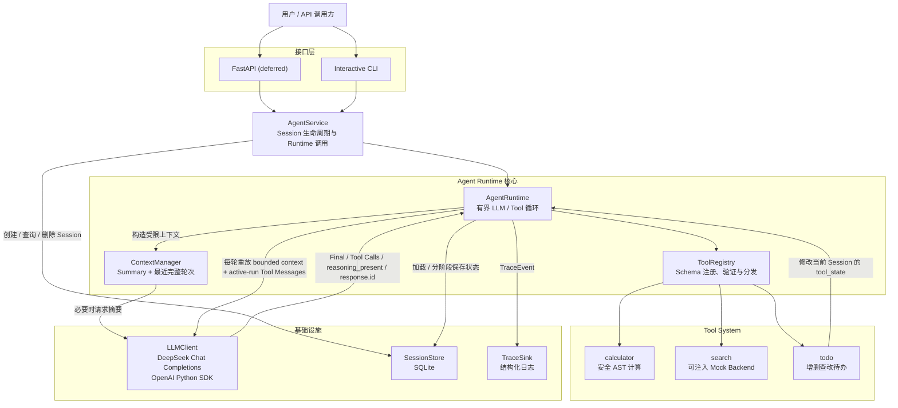
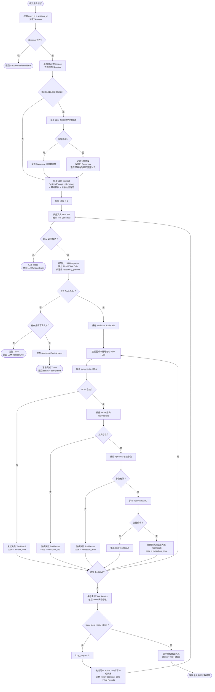

# Minimal Agent Runtime Diagrams

These diagrams visualize the frozen v1 architecture defined in `docs/architecture.md`.

## 1. System architecture

```mermaid
flowchart TB
    User["用户 / API 调用方"]

    subgraph Adapters["接口层"]
        API["FastAPI (deferred)"]
        CLI["Interactive CLI"]
    end

    Service["AgentService<br/>Session 生命周期与 Runtime 调用"]

    subgraph Core["Agent Runtime 核心"]
        Runtime["AgentRuntime<br/>有界 LLM / Tool 循环"]
        Context["ContextManager<br/>Summary + 最近完整轮次"]
        Registry["ToolRegistry<br/>Schema 注册、验证与分发"]
    end

    subgraph Tools["Tool System"]
        Calculator["calculator<br/>安全 AST 计算"]
        Search["search<br/>可注入 Mock Backend"]
        Todo["todo<br/>增删查改待办"]
    end

    subgraph Infrastructure["基础设施"]
        LLM["LLMClient<br/>DeepSeek Chat Completions<br/>OpenAI Python SDK"]
        Store["SessionStore<br/>SQLite"]
        Trace["TraceSink<br/>结构化日志"]
    end

    User --> API
    User --> CLI
    API --> Service
    CLI --> Service

    Service --> Runtime
    Service -->|"创建 / 查询 / 删除 Session"| Store

    Runtime -->|"加载 / 分阶段保存状态"| Store
    Runtime -->|"构造受限上下文"| Context
    Context -->|"必要时请求摘要"| LLM
    Runtime -->|"每轮重放 bounded context + active-run Tool Messages"| LLM
    LLM -->|"Final / Tool Calls / reasoning_present / response.id"| Runtime

    Runtime --> Registry
    Registry --> Calculator
    Registry --> Search
    Registry --> Todo

    Todo -->|"修改当前 Session 的 tool_state"| Runtime
    Runtime -->|"TraceEvent"| Trace
```

## 2. Runtime execution flow

```mermaid
flowchart TD
    Start(["收到用户请求"])
    Load["根据 user_id + session_id<br/>加载 Session"]
    Exists{"Session 存在？"}
    NotFound(["返回 SessionNotFoundError"])

    Append["追加 User Message<br/>立即保存 Session"]
    Threshold{"Context 超过压缩阈值？"}
    Compress["调用 LLM 总结旧的完整轮次"]
    CompressOK{"压缩成功？"}
    UseSummary["保存 Summary 和摘要边界"]
    Fallback["记录压缩错误<br/>保留旧 Summary<br/>选择可容纳的最近完整轮次"]
    BuildContext["构造 LLM Context<br/>System Prompt + Summary<br/>+ 最近轮次 + 当前执行消息"]
    BuildContinuation["构造同一 active run 的下一轮请求<br/>完整 replay assistant calls + Tool Results"]

    InitLoop["loop_step = 1"]
    LLMCall["调用真实 LLM API<br/>附带 Tool Schemas"]
    Timeout{"LLM 调用成功？"}
    LLMError(["记录 Trace<br/>抛出 LLMTimeoutError"])

    Normalize["规范化 LLM Response<br/>区分 Final / Tool Calls<br/>仅记录 reasoning_present"]
    HasTools{"包含 Tool Calls？"}

    SaveCalls["保存 Assistant Tool Calls"]
    NextTool["按返回顺序处理每个 Tool Call"]
    Parse["解析 arguments JSON"]
    ParseOK{"JSON 合法？"}
    ParseError["生成失败 ToolResult<br/>code = invalid_json"]

    Lookup["根据 name 查询 ToolRegistry"]
    Found{"工具存在？"}
    Unknown["生成失败 ToolResult<br/>code = unknown_tool"]

    Validate["使用 Pydantic 校验参数"]
    Valid{"参数有效？"}
    ValidationError["生成失败 ToolResult<br/>code = validation_error"]

    Execute["执行 Tool.execute()"]
    ExecuteOK{"执行成功？"}
    SuccessResult["生成成功 ToolResult"]
    ExecutionError["捕获异常并生成失败 ToolResult<br/>code = execution_error"]

    MoreTools{"还有 Tool Call？"}
    SaveResults["保存全部 Tool Results<br/>包括 Todo 状态修改"]
    Limit{"loop_step < max_steps？"}
    Increment["loop_step += 1"]
    MaxSteps["保存受控终止消息<br/>status = max_steps"]
    MaxEnd(["返回最大循环次数结果"])

    HasAnswer{"存在非空可见文本？"}
    ProtocolError(["记录 Trace<br/>抛出 LLMProtocolError"])
    SaveAnswer["保存 Assistant Final Answer"]
    Completed(["记录完成 Trace<br/>返回 status = completed"])

    Start --> Load --> Exists
    Exists -- "否" --> NotFound
    Exists -- "是" --> Append --> Threshold

    Threshold -- "否" --> BuildContext
    Threshold -- "是" --> Compress --> CompressOK
    CompressOK -- "是" --> UseSummary --> BuildContext
    CompressOK -- "否" --> Fallback --> BuildContext

    BuildContext --> InitLoop --> LLMCall --> Timeout
    Timeout -- "否" --> LLMError
    Timeout -- "是" --> Normalize --> HasTools

    HasTools -- "否" --> HasAnswer
    HasAnswer -- "否" --> ProtocolError
    HasAnswer -- "是" --> SaveAnswer --> Completed

    HasTools -- "是" --> SaveCalls --> NextTool --> Parse --> ParseOK
    ParseOK -- "否" --> ParseError --> MoreTools
    ParseOK -- "是" --> Lookup --> Found
    Found -- "否" --> Unknown --> MoreTools
    Found -- "是" --> Validate --> Valid
    Valid -- "否" --> ValidationError --> MoreTools
    Valid -- "是" --> Execute --> ExecuteOK
    ExecuteOK -- "是" --> SuccessResult --> MoreTools
    ExecuteOK -- "否" --> ExecutionError --> MoreTools

    MoreTools -- "是" --> NextTool
    MoreTools -- "否" --> SaveResults --> Limit
    Limit -- "是" --> Increment --> BuildContinuation --> LLMCall
    Limit -- "否" --> MaxSteps --> MaxEnd
```
